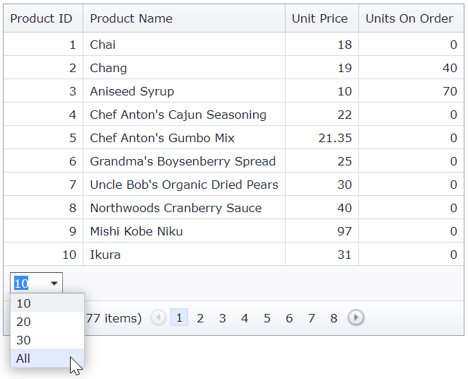

<!-- default badges list -->

[](https://supportcenter.devexpress.com/ticket/details/T190979)
[](https://docs.devexpress.com/GeneralInformation/403183)
[](#does-this-example-address-your-development-requirementsobjectives)
<!-- default badges end -->
# Grid View for ASP.NET MVC - How to create a custom page size item with the Show All Records button

This example demonstrates how to create the grid's footer template, add a custom page size item to the template, and display the **Show All Records** button.



## Overview

Call the grid's [SetFooterRowTemplateContent](https://docs.devexpress.com/AspNetMvc/DevExpress.Web.Mvc.GridViewSettings.SetFooterRowTemplateContent.overloads) method to add custom pager elements to the grid's footer.

**GridViewPartial.cshtml**

```cshtml
settings.SetFooterRowTemplateContent(c => {
    Html.RenderPartial("FooterRowPartial", c);
});
```

**FooterRowPartial.cshtml**

```cshtml
@Html.DevExpress().ComboBox(settings => {
    settings.Name = "cbPageSize";
    settings.Width = System.Web.UI.WebControls.Unit.Pixel(50);
    for (int i = 0; i < pageSizes.Length; i++) {
        settings.Properties.Items.Add(pageSizes[i].ToString(), pageSizes[i]);
    }
    settings.Properties.Items.Add("All", -1);
    if (Model.Grid.SettingsPager.Mode == GridViewPagerMode.ShowAllRecords) 
        settings.SelectedIndex = settings.Properties.Items.Count - 1;
    else
        settings.SelectedIndex = Array.IndexOf(pageSizes, Model.Grid.SettingsPager.PageSize);
    settings.Properties.ClientSideEvents.SelectedIndexChanged = "function(s, e) { GridView.PerformCallback({ pageSize: s.GetValue() }); }";
}).GetHtml()
```

You can also display the **Show All Records** button in the page size item of the built-in pager.

```cshtml
@Html.DevExpress().GridView(settings => {
    settings.Name = "GridView";
    settings.SettingsPager.PageSizeItemSettings.Visible = true;
    settings.SettingsPager.PageSizeItemSettings.ShowAllItem = true;
    <!-- ... -->
});
```

## Files to Review

* [HomeController.cs](./CS/Controllers/HomeController.cs) (VB: [HomeController.vb](./VB/Controllers/HomeController.vb))
* [FooterRowPartial.cshtml](./CS/Views/Home/FooterRowPartial.cshtml)
* [GridViewPartial.cshtml](./CS/Views/Home/GridViewPartial.cshtml)
<!-- feedback -->
## Does this example address your development requirements/objectives?

[](https://www.devexpress.com/support/examples/survey.xml?utm_source=github&utm_campaign=asp-net-mvc-grid-custom-pager-elements&~~~was_helpful=yes) [](https://www.devexpress.com/support/examples/survey.xml?utm_source=github&utm_campaign=asp-net-mvc-grid-custom-pager-elements&~~~was_helpful=no)

(you will be redirected to DevExpress.com to submit your response)
<!-- feedback end -->
